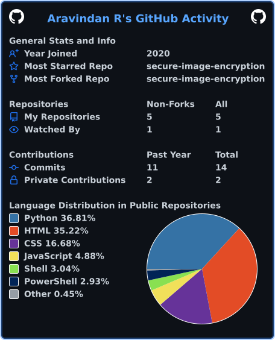

<div align="center">


</div>

---

## 🧠 whoami

```yaml
role: Dev / Security Tinkerer / Idea Machine
mission: Build -> Break -> Fix -> Ship -> Repeat
weapons: [Python, Linux, Networking, Bash, CTFs]
current_obsession: turning 3AM ideas into real projects
fuel: Caffeine
status: awake when I shouldn't be
motto: "Sleep is a bug I haven't patched yet"
```

- 🔐 Learning Cybersecurity — labs, CTFs, breaking stuff (legally)
- 💻 Writing scripts and automating things that don't need automating, but do now
- 🚀 Constantly cooking up startup ideas at 2AM
- 🌙 Peak productivity hours: everyone else's bedtime
- ☕ Running on caffeine, curiosity, and unfinished side projects

---

## 🌐 Connect With Me

<p align="center">
<a href="https://discord.gg/cDDaFfcD"></a>
<a href="https://www.instagram.com/arvnd.doingstuff"></a>
<a href="https://www.linkedin.com/in/aravindan-ravichandran-2b2144337/"></a>
<a href="https://www.reddit.com/u/Vortex_Scurge"></a>
<a href="mailto:aravinanravichandiran@gmail.com"></a>
</p>

---

## 🛠️ Tech Arsenal

<p align="center">

</p>

---

## 📊 The Numbers

<p align="center">

</p>

<!-- ^ This one is self-hosted via GitHub Actions (set up already) - will never break -->

---

## 🏆 Trophy Cabinet

<p align="center">

</p>

---

<div align="center">

### "There are two types of people: those who back up their data, and those who will."


</div>
